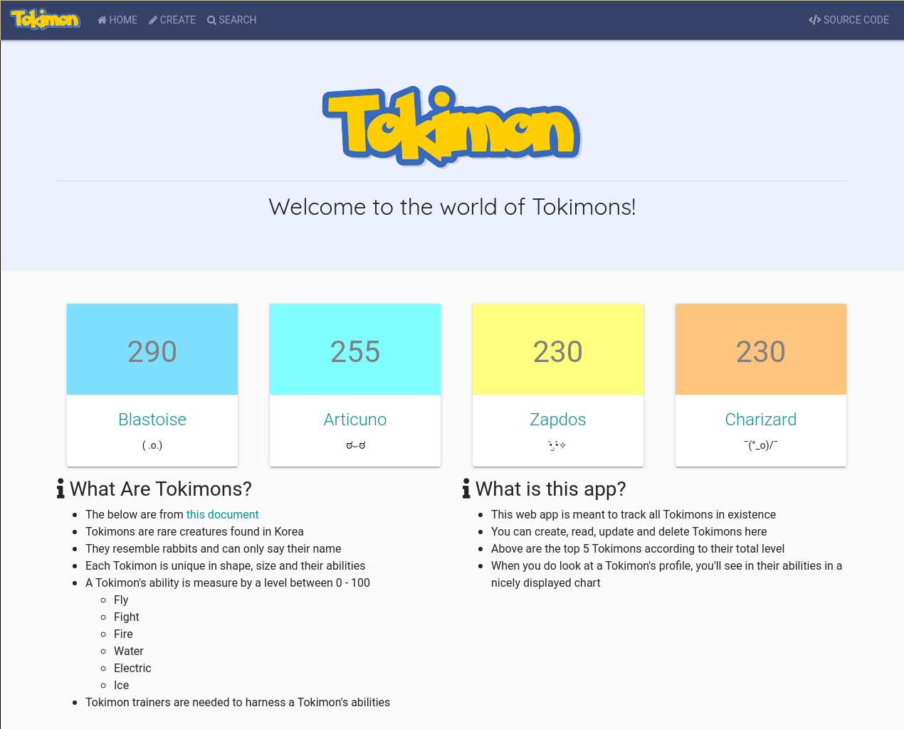
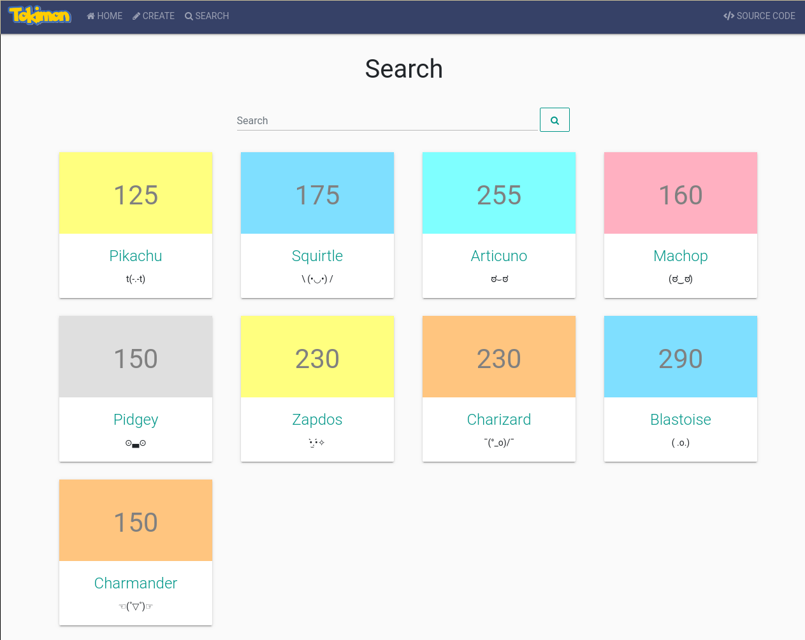
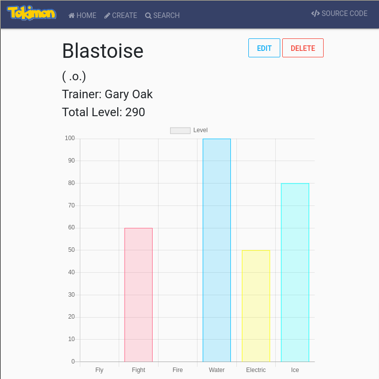

# 276 Tokimons

This app keeps track of all known Tokimons!

A combination of HTML, CSS, Javascript, and the Express framework was used to create this.

[Deployed on Heroku](https://shrouded-journey-27049.herokuapp.com/)

## Features

- Add a Tokimon to the database
- Display all Tokimons with a null search
- Show information about a specific Tokimon
- Update a Tokimon's information
- Delete a Tokimon

## Additional Features

- Match a Tokimon's highest attribute with a color 
- Display a chart of a Tokimon's attributes
- Responsive to mobile with Bootstrap
- Search for Tokimon's with names
- Show the top 4 Tokimons (by total level) on home page

## Built With

- HTML, CSS Javascript
- [Bootstrap 4](https://getbootstrap.com/) - Front-end library for the looks
- [jQuery](https://jquery.com/) - AJAX request for data
- [Chart.js](https://chartjs.org) - Display Tokimon levels in a pretty way
- [Express.js](https://expressjs.com/) - Back-end framework with Node
- PostgreSQL